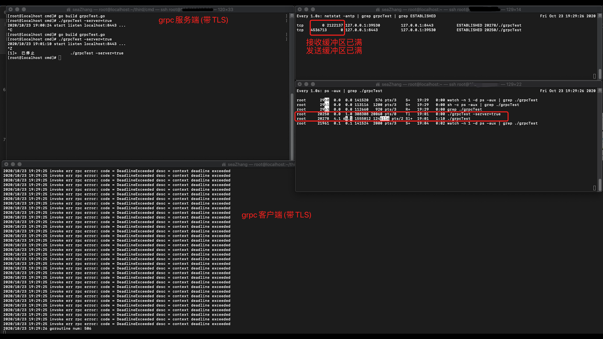
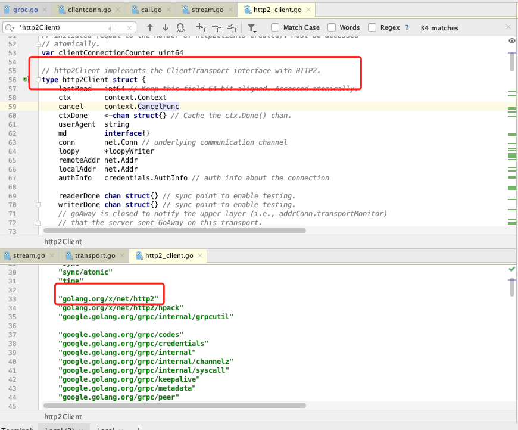
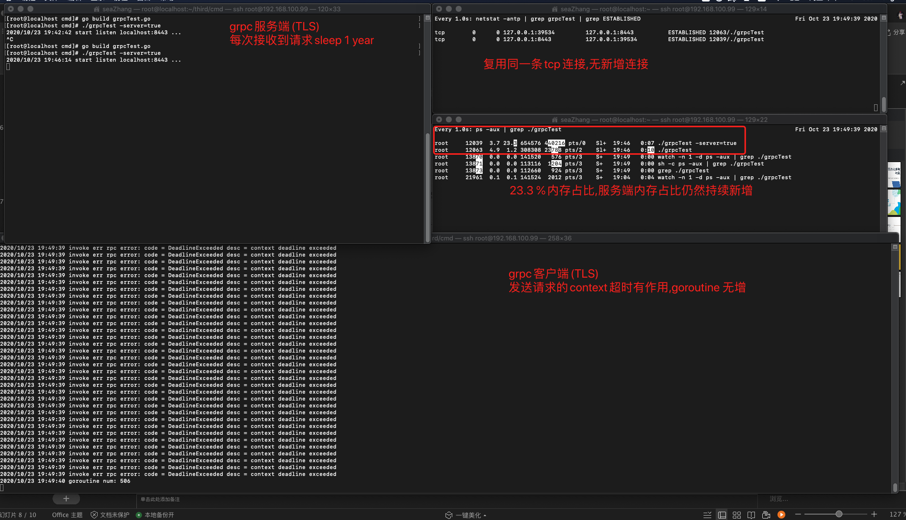

|  go版本   | grpc版本  |  protoc  | protoc-gen-go | protoc-gen-go-grpc |
|  ----  | ----  | ----  | ---- | ---- |
| go1.13.5 darwin/amd64  | google.golang.org/grpc@v1.33.1 | v3.13.0 | v1.25.0 | v1.0 |

实验1
---------
```$xslt
/**
测试流程:
1. 启动grpc server(带TLS)
2. 启动grpc client(带TLS),首次发送一条消息给grpc server后建立一条tcp连接(后续每2s内发送500次请求)  
3. 暂停grpc server(通过ctrl + z暂停服务端)  
4. grpc client 继续发送请求(每2s内发送500次请求)  
5. 继续观察,直到grpc server TCP接收缓冲区 和 grpc client TCP发送缓冲区 满时见以下截图
**/  
```

----------------------------
  

  

----------------------------
```$xslt
/**
结果观察:
grpc client timeout仍然有作用(goroutine 数量没变,占用内存%比持续上升) 

结论说明：   
1.客户端没有创建新的tcp连接
2.查看grpc客户端代码后发现grpc客户端使用的是 golang.org/x/net/http2,因   
  此应该是golang.org/x/net/http2做了一些变化
**/
```


实验3
---------
```$xslt
/**

测试流程:
1. 启动grpc server(带TLS),每接收到一条消息则sleep 1 年
2. 启动grpc client(带TLS),首次发送一条消息给grpc server后建立一条tcp连接(后续每2s内发送500次请求)
3. grpc client 继续发送请求(每2s内发送500次请求)  
**/  
```

----------------------------
  

----------------------------
```$xslt
/**
结果观察:
grpc client timeout仍然有作用(goroutine 数量没变,占用内存%比持续上升) 

结论说明：   
1.客户端没有创建新的tcp连接
**/
```